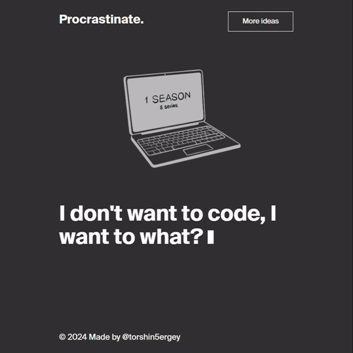

# Procrastinate.

Procrastinate. is a simple web page that suggests various activities to do instead of coding. It provides random ideas whenever the user clicks the "More ideas" button.  It is inspired by a practice project “Procrastinate” from the course “Frontend Developer” by Yandex Practicum.

## Description 


Procrastinate. is a playful web page designed to offer users amusing suggestions for activities they can do instead of coding. Sometimes, when faced with a daunting coding task, it's easy to feel overwhelmed and seek distraction. Procrastinate. embraces this tendency and provides a lighthearted solution.
The page features a simple layout with a logo at the top and a button labeled "More ideas." When users click the button, a random suggestion for procrastination appears along with an accompanying image.
Behind the scenes, Procrastinate. is powered by JavaScript. It utilizes query selectors and event listeners to handle user interactions. Additionally, it employs the Yandex library to achieve smooth transitions between suggestions, enhancing the overall user experience.

Whether users genuinely need a break from coding or simply want a moment of amusement, Procrastinate. offers a fun and engaging diversion, reminding them that it's okay to indulge in a bit of procrastination every now and then.

## Features

- Utilizes JavaScript for interactivity.
- Implements query selector and event listener to handle user interactions.
- Utilizes the smoothly library by Yandex Practicum for smooth transitions.

## Usage
To use this project, simply clone the repository and open the index.html file in your web browser.

```bash
git clone https://github.com/torshin5ergey/frontend-playground.git
cd frontend-playground/yandex-practicum-frontend/procrastinate
```

## Credits
- Illustrations and Text by Practicum.

## Author

Sergey Torshin [@torshin5ergey](https://github.com/torshin5ergey)